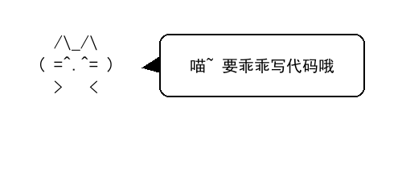

# 🐾 霸王喵 · BaWangMeow

  

> 名字很霸气，实际很怂。
> 一只在读研究生：主业给导师跑实验，副业给电脑喂 bug。

  

## 谁在敲键盘？

- 🎓 **在读研究生**：研究方向是「让设备听话、让导师满意、让自己顺利毕业」
- 🌱 **编程小白**：代码写得不多，报错看得不少，`print` 是我最好的朋友
- ☕ 靠咖啡因续命，靠 `Ctrl+Z` 保命，靠重启解决 90% 的玄学问题
- 😼 对外号称「霸王」，遇到 `Segmentation fault` 只能「喵」

## 方向 & 兴趣

🐱 撸猫 · ☕ 咖啡因依赖 · 💤 睡不醒 · 🎓 求毕业

## 猫生格言

> 猫踩键盘都能敲出能跑的代码，我为什么不行？
> —— 大概是因为我没有九条命，经不起这么多 bug。

## 我的能力值

| 技能 | 熟练度 |
| :--- | :--- |
| 复制粘贴 | ██████████ 100% |
| 上网找答案 | ██████████ 100% |
| 写 Bug | ████████░░ 80% |
| 查 Bug | ███░░░░░░░ 30% |
| 写代码 | ██░░░░░░░░ 20%（努力上升中）|

## 正在努力的事

- [ ] 让代码第一次就跑通
- [ ] 看懂自己上周写的代码
- [ ] 少对导师说「快了，快写完了」
- [ ] 顺利毕业，不被延毕 🎓

## 📈 战绩面板

  

  

  

---

我的仓库有点乱，但我的心是干净的。🐱
